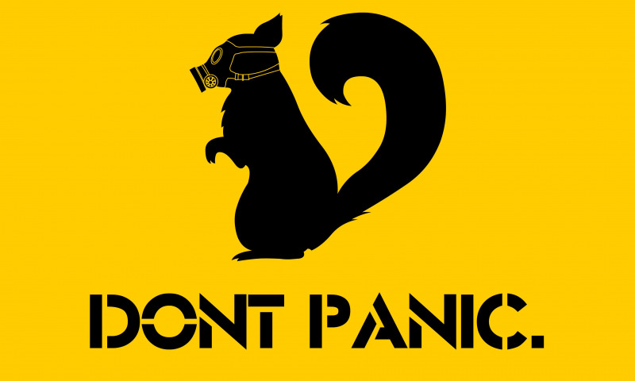

+++
title = "3 июня 2020"
+++

### Заболевшие ролевики

**Здесь собираем факты (и только их) про коронавирус и ролевиков.** Мы знаем, что в нашу перепись попадают не все случаи среди играющих в РИ. Сначала нам казалось важным фиксировать, что коронавирус от нас далеко. Теперь, когда он близко, нам кажется важным записывать ссылки на впечатления и опыт (очень разные) от людей, которых мы знаем лично или через пару рукопожатий.

3 июля. Давненько здесь не было обновлений, но народ интересуется, как там дела у ролевиков. Обновления по нашим товарищам по хобби в записях ниже и свежие случаи (и обновление счетчика, само собой)

* [Переболел Олаф](https://vk.com/wall1431289_1820)
* [Болел Tsubasa](https://mobile.twitter.com/SpbTsubasa/status/1271758083241451520). Кажется, [в реестр РПН не попал](https://mobile.twitter.com/SpbTsubasa/status/1272454583562969089), поэтому выздоровел тихонько и без фанфар исключения из оифциальных список. 

11 июня. 

* [Переболел Сеффолк](https://vk.com/wall3164462_29602?reply=29610&thread=29604).
* [Положительный тест у Лисиц Линнх](https://vk.com/wall2306669_16097). UPD [Выздоровела!](https://vk.com/wall2306669_16521)

9 июня. [Болеет Динальф](https://vk.com/wall1260103_2520). Болеет с 18 мая и хочет уже официально поправиться, но пока не вернулись результаты тестов. [Официально свободен!](https://vk.com/wall1260103_2563)

8 июня. [Заболела Вирна](https://t.me/c/1274242365/68030). Положительный анализ на IgM антитела, потом — положительный ПЦР-мазок. Из симптомов — субфибрелит. UPD [выздоровела!](https://t.me/c/1274242365/69723)

5 июня. [Заболел Рамил](https://vk.com/wall4808210_735).

3 июня. Ксотару после перенесенного воспаления легких и последовательных трех отрицательных ПЦР-мазков на ковид — наконец [пришел положительный анализ на антитела IgG](https://t.me/c/1274242365/66964). 

25 мая. Новости из Петербурга:

* [Заболел Алекс Муллин](https://t.me/c/1274242365/64721) (25% двусторонняя пневмония, отправлен в  «ковидный» пансионат «Заря»). UPD 06.06 Выписан долечиваться домой, [«всё сильно лучше»](https://t.me/c/1274242365/67867).
* У [Либеры](https://vk.com/wall759538_6251?reply=6273&thread=6271) симптомы есть, но подтверждения диагноза пока нет (плюс один под вопросом).
* [Болеет Акир](https://vk.com/wall19060011_17375)

23 мая. Положительный ПЦР-тест у [KingOndatra](https://mobile.twitter.com/King_Ondatra/status/1263777267332919296). Симптомов пока нет.

22 мая. Простор и Мару пару недель назад болели ОРВИ (ПЦР-анализ на новый коронавирус отрицательный), а теперь — первые ролевики без подтвержденного ковида, но с положительным результатом на антитела к нему (IgG). И попадают в счетчик переболевших, минуя счетчик больных :)

17 мая. День плохих новостей. 

* Один из ролевиков-врачей, Юрич, [в больнице](https://www.facebook.com/anna.abramenkova.98/posts/3075466069205449) с осложнениями сovid-19 — пневмонией. UPD 18.05 [Новости от самого Юрича](https://www.facebook.com/tihmyanov/posts/2972871472780650) UPD 29.05 Юричу лучше, [он написал пост про личный опыт заболевания глазами врача-рентгенолога](https://zabzamok.livejournal.com/380370.html)
* 31 марта умерла от пневмонии [Ласточка](https://vk.com/wall-188350311_2613), «основоположник того, чем стало ролевое движение в Перми». [Посмертный положительный анализ на новый коронавирус](https://vk.com/wall730795_5145).

13 мая. Заболел [Рейегар](https://vk.com/wall8056731_2719).
Болеет [Алиса](https://vk.com/wall50940468_19073) (подтвержденный ПЦР-методом).

4 мая. Заболела [Валя Коричина](https://www.facebook.com/1507445974/posts/10217286340779690/?d=n).

3 мая 2020. Болеет [Бронвег](https://vk.com/wall982602_6555). UPD 13.05 [На КТ пневмонии больше нет](https://vk.com/wall982602_6799), поправился.

1 мая 2020. Тис попала в инфекционную больницу с коронавирусом. UPD 13.05 Выздоровела, выписана.

29 апреля 2020. Заболел муж [Огневки](https://vk.com/wall48987_3469), не ролевик (диагноз подтвержден). Update 10 мая: мазок для ПЦР Огневка решила не делать, так что это «плюс один под вопросом» для ролевого счетчика. Все уже поправились, ждут повторного теста пациента-1.

25 апреля 2020. Vampire болеет (была [видна пневмония с «матовым стеклом» на КТ](https://t.me/c/1274242365/53387), теперь пришло и подтверждение с ПЦР). UPD 17.05 Пришел второй отрицательный мазок, успешно выздоровел. 

13 апреля 2020. Подтвержден диагноз по результатам ПРЦ у болеющих [Ильи Халиля](https://vk.com/wall4329581_1117) и Жени Буровой. Update 29 апреля: в настоящий момент ребята здоровы и выписались после отрицательных тестов.

9 апреля 2020. Заболели [Торкес](https://www.facebook.com/anna.torkes/posts/2956225221080970) и [Ори](https://vk.com/wall3409833_4143). Update 29 апреля: ребята уже выздоровели. 
 
19 марта 2020. ~~В настоящий момент есть непроверенные сведения об 1 возможно заболевшем короновирусом ролевике~~. Эти сведения были опровергнуты. Симптомы ОРВИ сами по себе не причина для паники, все будет хорошо.
 
 - [Подробности про Комкон на отдельной странице](comcon)
 - [Что с играми?](cancel-games)

### Что делать, если я заболел или был в контакте с больными?

1. Останьтесь дома и вызовите врача. [Официальные рекомендации Роспотребнадзора](https://rospotrebnadzor.ru/about/info/news_time/news_details.php?ELEMENT_ID=13566)
2. Уведомите мастеров игр и организаторов конвентов, на которых вы недавно были.
3. Напишите нам на <support@joinrpg.ru> или в личку группы [vk.com/joinrpg](https://vk.com/joinrpg), мы добавим информацию на сайт, чтобы контактировавшие могли среагировать.

[КОВИД-19: обзор болезни для Москвы](https://docs.google.com/document/d/1L_1G5dqcFpvQk0ZKDQB2zZ_b4LpF-ddaU6DeM6AhHeI/edit) от Жени Буровой.

### Чаты

**Дайджест**: <https://t.me/joinchat/AAAAAEThRkbRdyaWc83-BA>

**Чат**: <https://t.me/joinchat/Db1kaBs1CL-JSQzHEt6fIQ> (защищен ботом «Ничей Друг». Если вы не знаете, что это такое, вам скорее всего не попасть в чат).

### Эта страница

© **Атана&ЛеоЦарев, 2020**
[Редактировать на github](https://github.com/leotsarev/corona-comcon/blob/master/content/_index.md)
